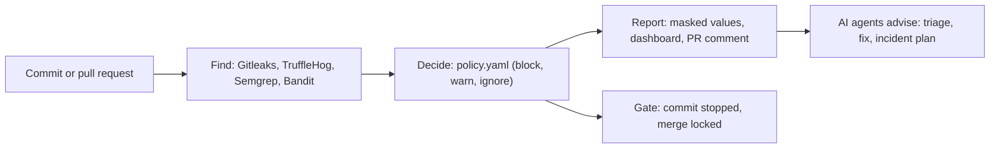

# SecureGate

**SecureGate stops leaked passwords, keys and tokens before they reach your main code.**

Developers sometimes paste a key into their code by mistake. Deleting the line later does not help: Git keeps every old version, and bots search public code for keys all day. SecureGate finds them in every commit, decides what to do with one readable rule file, and blocks the dangerous ones, on your laptop and on GitHub. It never shows a whole secret: a found key appears as `sk_l****562d`.

## What it does

- **Four scanners, one verdict.** Gitleaks and TruffleHog read every commit; Semgrep and Bandit read the code. SecureGate merges what they find into one finding per key.
- **One readable rule file decides.** `policy.yaml` says what to block, what to warn about and what to ignore, with a reason and a fix for every rule.
- **Two gates.** A check before each commit on the laptop, and the `secret-gate` check on every pull request on GitHub: a red check locks the merge button, and SecureGate explains itself in one comment, with a checklist to replace the key.
- **Nobody sees a whole secret.** Reports, the dashboard, pull request comments and SARIF hold masked values only.
- **Three AI agents advise.** On Azure AI Foundry: one explains each finding, one writes the fixed line of code, one plans the response to a leak. They never see a whole key, and the rule file still decides.
- **No commands needed.** Double-click `Start SecureGate.cmd` for a menu that runs everything, and a read-only dashboard in the browser.

## See it in 10 minutes

On Windows, double-click **`Start SecureGate.cmd`**. The first time, install the tools in step 1 of [Getting started](docs/getting-started.md). Then follow **[Demo day](docs/demo-day.md)**: the whole demo on one page, from the menu.

Every key in the demos is fake: ACME Pay is a payment provider invented for them.

## Documentation

| Page | For |
|---|---|
| [Demo day](docs/demo-day.md) | showing SecureGate to judges, step by step |
| [Getting started](docs/getting-started.md) | installing it and the first scan |
| [How it works](docs/how-it-works.md) | one leaked key, from discovery to report |
| [The two gates](docs/merge-gate.md) | the laptop gate and the merge gate on GitHub |
| [The AI agents](docs/agents.md) | what they do, what is sent and what never is |
| [Dashboard](docs/ui.md) | the pages, downloads and printing |
| [Limitations](docs/limitations.md) | what it does not do yet |
| [All pages](docs/README.md) | everything else, also as PDFs in `docs/pdf/` |

## Built with

Python 3.12; Gitleaks 8.30.1, TruffleHog 3.97.9, Semgrep 1.179.0 and Bandit 1.9.4; Flask for the dashboard; pre-commit for the laptop gate; GitHub Actions for the merge gate; Azure AI Foundry for the AI agents. 982 automatic tests, including tests that fail if a whole fake secret ever appears in any output.
