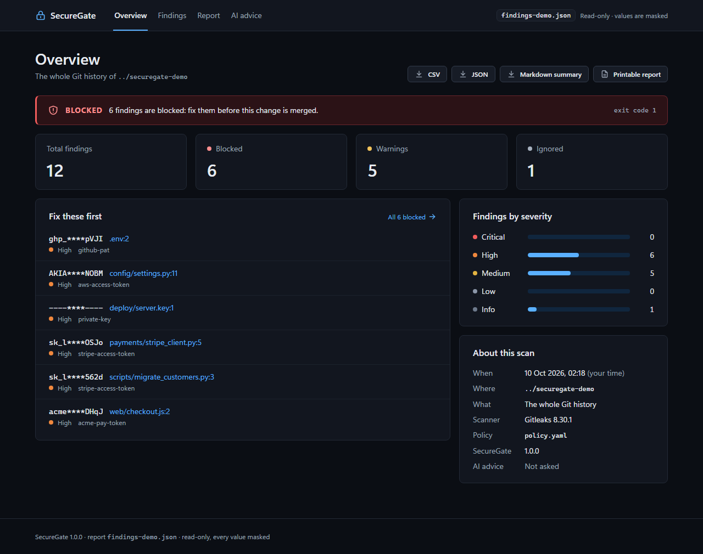
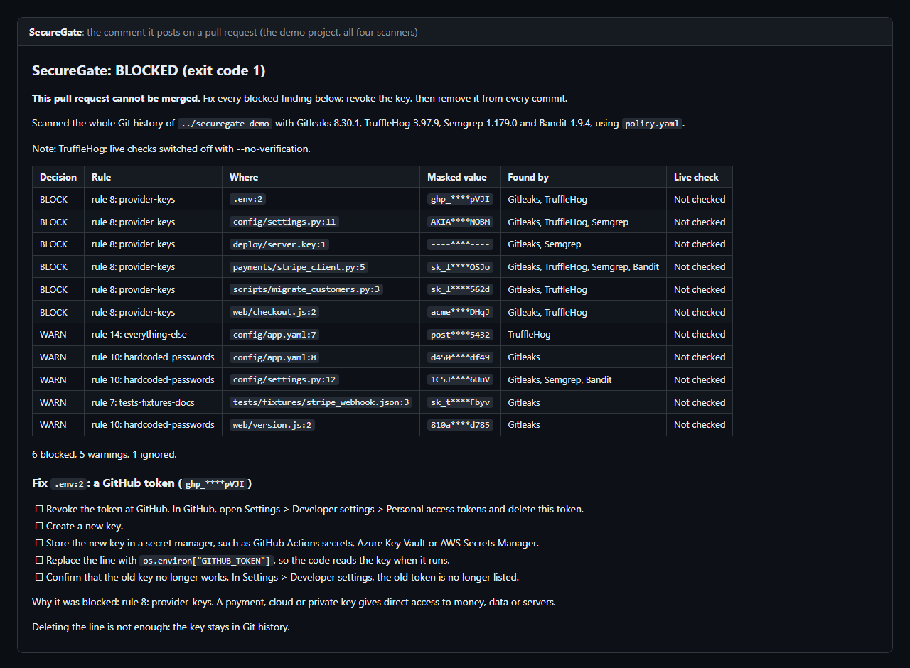
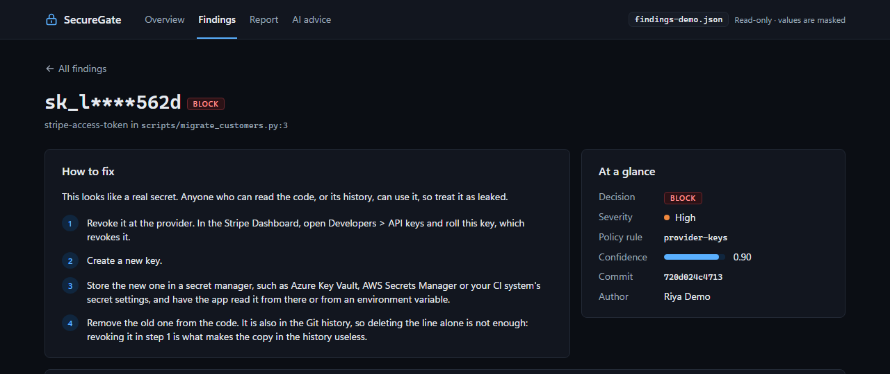
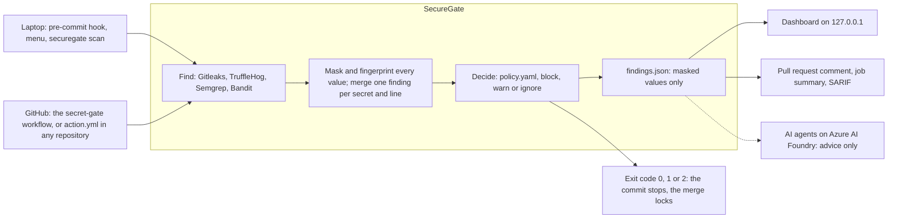

# SecureGate

**SecureGate stops leaked passwords, keys and tokens before they reach your main code.**

> **Completed:** built for Microsoft Innovate 2026 (Problem Statement 24). Not actively maintained.

## The problem

Developers paste keys into code by mistake, and deleting the line later does not help: Git keeps every old version, and bots search public code for keys all day. Secret scanners find the keys, but each one finds different things, none of them decides what should happen next, and their reports often print the very secret they found. SecureGate runs four scanners, lets one readable rule file decide, and blocks the dangerous keys on your laptop and on GitHub without ever showing a whole secret: a found key appears as `sk_l****562d`.

## Three layers

1. **Find and decide, on your laptop.** `securegate scan` reads every commit with Gitleaks, and with TruffleHog, Semgrep and Bandit when asked. `policy.yaml` decides **block**, **warn** or **ignore**, with a reason and a fix for each finding. A pre-commit hook stops a commit that holds a key, and a read-only dashboard shows the report in your browser. A menu runs it all without typing commands: double-click `Start SecureGate.cmd`.
2. **The merge gate, on GitHub.** Every pull request to main is scanned by all four scanners, with the rules from main, so a pull request cannot loosen the rules that judge it. SecureGate posts one comment with a checklist to replace each leaked key, sends the findings to the Security tab, and a red check locks the merge button. Any repository can use the same gate as a GitHub Action.
3. **AI agents that advise.** On Azure AI Foundry, three agents explain each finding, write the fixed line of code and plan the response to a leak. They never see a whole key, and `policy.yaml` still decides.







## Quick start

You need Git, Python 3.12, GNU Make and Gitleaks 8.30.1; on Windows, step 1 of [Getting started](docs/getting-started.md) installs them with winget. Then, in PowerShell or any terminal:

```powershell
git clone https://github.com/Bhavik-Kadian/Nexora.git SecureGate
cd SecureGate
make setup
make demo
make scan-demo
```

`make demo` builds DemoPay, a fake payments app full of planted fake keys, next to the SecureGate folder. `make scan-demo` scans its whole history and prints a table of masked findings; it ends with `Error 1` on purpose, because the demo holds keys to block. `make ui` then shows the report in your browser. On Windows, double-click `Start SecureGate.cmd` for the menu instead.

Every key in the demos is fake: ACME Pay is a payment provider invented for them.

## Protect any repo

Add one workflow file to any GitHub repository, and every pull request gets SecureGate's merge gate:

```yaml
      - uses: actions/checkout@3d3c42e5aac5ba805825da76410c181273ba90b1 # v7.0.1
        with:
          fetch-depth: 0
          persist-credentials: false
      - uses: Bhavik-Kadian/Nexora@v1.0.0
```

The whole file, the settings, your own rules and the laptop gate for another repository: [Protect any repository](docs/install.md).

## Architecture



Every value is masked in memory, before anything is printed or saved. Errors fail closed: when a required scanner or the policy fails, SecureGate exits with code 2, and the gate never passes without looking. [How it works](docs/how-it-works.md) follows one leaked key through every step.

## Tech stack

| Part | Built with |
|---|---|
| The engine | Python 3.12, PyYAML, Jinja2 |
| Scanners | Gitleaks 8.30.1, TruffleHog 3.97.9, Semgrep 1.179.0, Bandit 1.9.4, pinned and checked |
| Dashboard | Flask, read-only, on 127.0.0.1, with no JavaScript |
| Laptop gate | pre-commit |
| Merge gate | GitHub Actions (a workflow, and a composite action for other repositories), SARIF for the Security tab, the GitHub CLI |
| AI agents | Azure AI Foundry, called with Python's own HTTPS client |
| Quality | pytest (over 1,000 tests, including tests that fail if a whole fake secret appears in any output), ruff, actionlint |
| Docs | Markdown, with a PDF copy of every page |

## Documentation

Start with [Getting started](docs/getting-started.md), or [Demo day](docs/demo-day.md) to show SecureGate in 10 minutes. [All pages](docs/README.md) lists every page: how it works, the two gates, the AI agents, the dashboard, limitations, decisions, and the close-out: [Project closure](docs/project-closure.md), the [Roadmap](docs/roadmap.md) of what was never built, and the [Changelog](CHANGELOG.md). Found a problem? See [SECURITY.md](SECURITY.md).

## Team

Built by **Team Nexora** for Microsoft Innovate 2026.

| Name | Role |
|---|---|
| Bhavik Kadian | Lead Developer / Backend |

## License

[MIT](LICENSE), Copyright (c) 2026 Team Nexora.
