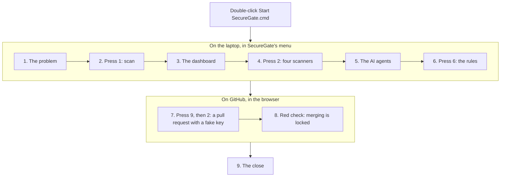

# Demo day: show SecureGate in 10 minutes

This is the whole demo on one page. Everything happens in **one window, SecureGate's menu**, and in your web browser: you never type a command. Each step says which key to press, what the judges see, and one sentence to say (put it in your own words).

## The show at a glance

| Step | Press | Time |
|---|---|---|
| 1. The problem | nothing | 30 s |
| 2. Scan a fake company's project | **1** | 1 min |
| 3. The dashboard | **Enter** | 1 min |
| 4. Four scanners and the pull request comment | **2** | 1 min |
| 5. The AI agents | **Enter** twice | 2 min |
| 6. The rules | **6** | 30 s |
| 7. A real pull request with a fake key | **9**, then **2** | 2 min |
| 8. GitHub refuses to merge it | (the browser) | 1 min |
| 9. The close | nothing | 30 s |

## Before the judges arrive (10 minutes, with the internet)

1. **Open SecureGate:** double-click `Start SecureGate.cmd` in the SecureGate folder. Maximize the window and make the text bigger: hold **Ctrl** and turn the mouse wheel.
2. **Check the first screen.** It should say `all four ready` (Scanners), `ready` (Demo) and `ready` (AI agents). If the demo project is not built yet, press **7**, then **y**, to build it.
3. **Check GitHub:** press **9**, then **9**. Every line should say **PASS**. If `required check` says FAIL, GitHub does not lock the merge button yet: do "The one-time setting" in [The two gates](merge-gate.md) once (about 2 minutes, in the browser). Then press Enter, then **B**.
4. **Check the AI:** press **A**, then **5**. It should say `PASS  AI connection: the model answered`. Press Enter, then **B**.
5. **Open the browser**, signed in to GitHub, at `github.com/Bhavik-Kadian/SecureGate`.
6. **Make a backup:** press **9**, then **2**, press Enter to open the pull request in the browser, and type **n** for the rest. Keep that tab open: if the internet is slow during the demo, you can show this pull request, already red. Press Enter, then **B**.
7. Turn on **Do not disturb** in Windows. The menu is back on its first screen: you are ready.

## The show

### 1. The problem (30 seconds)

Nothing to press.

> Developers sometimes paste passwords and keys into their code by mistake. Deleting the line later does not help: Git keeps every old version, and bots search public code for keys all day. SecureGate finds them, decides what to do with one readable rule file, and stops them before they reach the main code. And it never shows a whole secret, not even in its own reports.

### 2. Scan a fake company's project (1 minute)

**Press 1.** SecureGate scans DemoPay, a fake payments app full of planted fake keys, through its whole Git history.

**The judges see** a table: each key it found, masked like `sk_l****562d`, marked **block**, **warn** or **ignore**, and the result: **BLOCKED**.

> Every value is masked: only the first and last four characters are shown. Some keys are blocked, some only get a warning, and placeholders are ignored, all decided by one rule file. One key was even deleted from the code months ago: SecureGate still finds it, in the history.

### 3. The dashboard (1 minute)

The menu asks `Ask the AI agents about these findings?`: type **n** (they come in step 5). At `Open the results in the dashboard? [Y/n]`, **press Enter**. The dashboard opens in the browser.

**Show:** the red **BLOCKED** bar at the top, then click one blocked finding: its **How to fix** steps, starting with "Revoke it at the provider".

> The dashboard runs only on this laptop, needs no internet, and shows masked values only. Every finding says why it was blocked and exactly how to fix it.

Back in the menu window, **press Enter** to close the dashboard.

### 4. Four scanners and the pull request comment (1 minute)

**Press 2.** The same project, now with **four scanners**: Gitleaks, TruffleHog, Semgrep and Bandit. At `Show the comment a pull request would get? [Y/n]`, **press Enter**: the window shows the comment that GitHub will get.

> Each scanner catches things the others miss. SecureGate merges what they find into one verdict, and writes one clear comment for the pull request, with a checklist to replace each leaked key.

### 5. The AI agents (2 minutes)

At `Ask the AI agents about these findings? [Y/n]`, **press Enter**. Three AI agents read the findings; it takes about a minute, so say this while they work:

> Three AI agents now help the reviewer: one explains each finding, one writes the fix, one plans the response. They never see a whole key: SecureGate takes every value out before anything is sent. And they only advise: the rule file still decides.

At `Open the results in the dashboard? [Y/n]`, **press Enter**, then click **AI advice** at the top of the dashboard.

**Show:** the incident plan (revoke the keys, make new ones, check the logs, tell the right people), the triage (each finding likely real or a false alarm, and why), and the suggested fixes, such as a line rewritten as `STRIPE_SECRET_KEY = os.environ["STRIPE_SECRET_KEY"]`. Then press **Enter** in the menu window to close the dashboard.

### 6. The rules (30 seconds)

**Press 6.** The rules of `policy.yaml`, top to bottom, each with its number and decision.

> This one file decides, not the scanners and not the AI. A security team can read it and change it without touching any code.

Press **Enter** to go back.

### 7. A real pull request with a fake key (2 minutes)

**Press 9, then 2.** SecureGate opens a real pull request on GitHub with a fake payment key in it. It builds it in a temporary folder, so nothing on this laptop changes.

- At `Open it in your browser? [Y/n]`: **press Enter**. The pull request opens.
- At `Wait here for the merge gate's result (about a minute)? [Y/n]`: **press Enter**, and say:

> GitHub is now running SecureGate on its own computers, with all four scanners, on every commit of this pull request. A developer can skip a check on their own laptop; they cannot skip this one.

**The judges see** in the window: `is red`, `SecureGate said: BLOCKED` and `Merging: locked`. Type **n** at the next two questions.

### 8. GitHub refuses to merge it (1 minute)

In the browser, reload the pull request. **Show:** the red cross next to **secret-gate**, the box saying merging is blocked, and SecureGate's comment: the masked key, the rule that blocked it, and the checklist to replace the key.

> Nobody, not even an admin, can merge this while the check is red. And deleting the line in a new commit would not help: the key stays in the history, so the real fix is to cancel the key and make a new one.

Optional, if there is time: in the menu, press Enter, then **F**: the fix agent opens a second pull request that fixes the code for you.

### 9. The close (30 seconds)

> To sum up: four scanners find secrets, one readable rule file decides, nobody ever sees a whole secret, GitHub refuses to merge a leak, and AI agents help people fix it. SecureGate stops leaks before they reach the main code.

## After the demo

In the menu: **9**, then **8**, then **y**: SecureGate closes the demo pull requests and deletes their branches. Then **B**, then **Q**, to close SecureGate.

## If something goes wrong

| What happens | What to do |
|---|---|
| No internet | Steps 1 to 4 and 6 work offline; skip step 5. For steps 7 and 8, show the backup tab or your screenshots, or press **3** on the first screen to show the pull request comment. |
| GitHub is slow | Show the backup pull request from "Before the judges arrive", already red. |
| `Merging: NOT locked` | The one-time setting on GitHub is missing. The check is still red; set it up after the demo ([The two gates](merge-gate.md)). |
| The AI does not answer | Skip step 5: the rest of SecureGate never depends on it. |
| `the working tree has uncommitted changes` | Files in the SecureGate folder changed. Skip steps 7 and 8, and show the backup tab. |
| Scanners say `Gitleaks only` | Skip step 4 and 5, or install the other three once with `make scanners` (needs the internet). |

## Questions judges often ask

- **Is any real secret used?** No. Every key in the demo is invented, made up on the spot, and unlocks nothing; the AI agents never see a whole value either.
- **Who decides block or allow, the AI?** No: the rule file `policy.yaml` decides. The AI only gives advice, labelled as advice.
- **Can a developer get around it?** On the laptop, yes, on purpose. On GitHub, no: the check runs for every pull request, with the rules from the main branch, so a pull request cannot loosen the rules that judge it.
- **Does deleting the key fix it?** No: the key stays in the Git history. The fix is to cancel the key at the provider and make a new one.

More detail, every command and more answers: [Presenting to judges](presenting-to-judges.md) and [Demo: the merge gate](demo-script.md).
