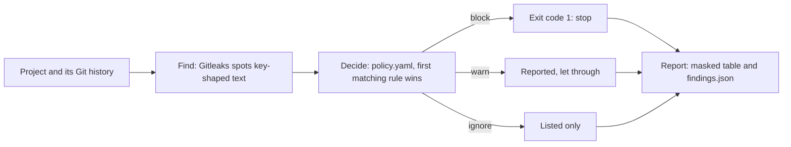

# How it works

This page follows one leaked key, from the moment it is found to the report you read.

## The example

Riya works on DemoPay, a small payments app. She pastes a live Stripe key into a one-off script, `scripts/migrate_customers.py`. A Stripe key is the password that lets an app take real card payments.

She **commits** the script. A commit is a saved snapshot of the project in **Git**, the tool that keeps a project's history.

A day later she deletes the script and commits again. The key is gone from the latest code. It is not gone from Git.

## Step 1: Find

SecureGate asks **Gitleaks**, a free scanner, to read every commit. Gitleaks knows the shapes of many kinds of keys. Stripe live keys start with `sk_live_`, so Gitleaks spots this one in the commit where Riya added it.

At this moment the full key exists only in SecureGate's memory. It is never printed or saved.

## Step 2: Decide

SecureGate checks the finding against the rules in `policy.yaml`, from top to bottom. The first rule that matches decides:

1. `placeholders`: is it an obvious fake, like `changeme`? No.
2. `tests-fixtures-docs`: is it in a tests, fixtures or docs folder? No.
3. `provider-keys`: is it an ACME, AWS or Stripe key, or a private key? **Yes, so: block.**

## Step 3: Report

SecureGate hides the key before it shows anything. This is called **masking**. A value of 16 or more characters keeps only its first 4 and last 4 characters; a shorter one becomes `****`.

It also makes a **fingerprint**: a code that recognizes the same key again later, without storing the key.

```
DECISION  RULE                 FILE:LINE                       VALUE
block     stripe-access-token  scripts/migrate_customers.py:3  sk_l****562d
```

The full details go to `findings.json`. SecureGate then ends with **exit code 1**. An exit code is the number a program gives back when it finishes, so that other tools can react. 1 means "at least one finding is blocked".

## Why deleting the line is not enough

Git keeps every commit. Anyone with a copy of the project can open the old commit and read the key. Deleting the line only hides it from the newest version.

The only real fix is **rotation**: create a new key at Stripe, switch the app to it, and cancel the old one. The leaked key then stops working.

## What block, warn and ignore mean

| Decision | What it means | What to do |
|---|---|---|
| block | A real secret is very likely exposed. SecureGate ends with exit code 1. A future merge gate will use that to stop the change. | Rotate the secret, then remove it from the code. |
| warn | Maybe a secret, maybe not. It is reported, but it does not stop anything. | Check it. If it is real, treat it like a block. |
| ignore | Not a secret, for example the placeholder `YOUR_API_KEY_HERE`. It is only listed in `findings.json`. | Nothing. |

## The whole journey


