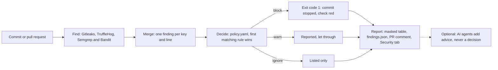

# How it works

This page follows one leaked key, from the moment it is found to the report you read, and then to the pull request that GitHub refuses to merge.

## The example

Riya works on DemoPay, a small payments app. She pastes a live Stripe key into a one-off script, `scripts/migrate_customers.py`. A Stripe key is the password that lets an app take real card payments.

She **commits** the script. A commit is a saved snapshot of the project in **Git**, the tool that keeps a project's history.

A day later she deletes the script and commits again. The key is gone from the latest code. It is not gone from Git.

## Step 1: Find

SecureGate asks **Gitleaks**, a free scanner, to read every commit. Gitleaks knows the shapes of many kinds of keys. Stripe live keys start with `sk_live_`, so Gitleaks spots this one in the commit where Riya added it.

At this moment the full key exists only in SecureGate's memory. It is never printed or saved.

With `--scanners all`, a second scanner, **TruffleHog**, reads the history too. It can also ask Stripe whether the key still works, which Gitleaks cannot. Two code checkers join them: **Semgrep** looks for key formats and for code that handles a secret carelessly, such as printing it to a log, and **Bandit** looks for passwords written in Python code. When several find the same key or line, SecureGate reports it once and names them all.

## Step 2: Decide

SecureGate checks the finding against the rules in `policy.yaml`, from top to bottom. Each rule has its number from SecureGate's policy table. The first rule that matches decides:

1. Rule 1, `verified-live`: did the provider confirm that the key works right now? Only TruffleHog can ask; here nobody did.
2. Rule 3, `placeholders`: is it an obvious fake, like `changeme`? No.
3. Rule 7, `tests-fixtures-docs`: is it in tests, fixtures or docs, or in a Markdown or example file? No.
4. Rule 8, `provider-keys`: does the value have the format of a live payment, cloud or GitHub key, or is it a private key? It starts with `sk_live_`: **yes, so: block.**

The rules after it, for test-mode keys, passwords written in the code, risky handling of secrets and everything else, are never reached.

## Step 3: Report

SecureGate hides the key before it shows anything. This is called **masking**. A value of 16 or more characters keeps only its first 4 and last 4 characters; a shorter one becomes `****`.

It also makes a **fingerprint**: a code that recognizes the same key again later, without storing the key.

```
DECISION  RULE                 FILE:LINE                       VALUE
block     stripe-access-token  scripts/migrate_customers.py:3  sk_l****562d

Blocked:
  scripts/migrate_customers.py:3  sk_l****562d
    why: provider-keys: A payment, cloud or private key gives direct access to money, data or servers.
    fix: Treat it as leaked. Rotate (replace) the key at the provider now, remove it from the code, and load it from an environment variable or a secrets manager instead.
```

For every blocked finding it says why it was blocked and how to fix it. Both lines come from the matching rule in `policy.yaml`: its `reason` and its `remediation`.

The full details go to `findings.json`. SecureGate then ends with **exit code 1**. An exit code is the number a program gives back when it finishes, so that other tools can react. 1 means "at least one finding is blocked".

## Step 4: The pull request on GitHub

Riya pushes her branch and opens a **pull request**: a request to add her commits to the main version of DemoPay. Before anyone can merge it, GitHub runs SecureGate's check, `secret-gate`, on its own computers:

1. All four scanners look: Gitleaks and TruffleHog read **every commit** of the pull request, including the one that deleted the script; Semgrep and Bandit read the code it changed.
2. TruffleHog asks Stripe whether the key still works. If it does, the finding becomes **rule 1, `verified-live`**: critical, blocked, whatever else is true about it.
3. SecureGate merges what the scanners found: the same key on the same line is one finding, which names every scanner that saw it.
4. `policy.yaml` decides, with the rules taken from main, so the pull request cannot loosen the rules that judge it.

The check turns **red**, and with the one-time setting in [The two gates](merge-gate.md), the merge button stays locked. SecureGate also posts one comment on the pull request, and keeps it up to date on every push:

```markdown
### SecureGate: BLOCKED (exit code 1)

**This pull request cannot be merged.** Fix every blocked finding below: revoke the key, then remove it from every commit.

| Decision | Rule | Where | Masked value | Found by | Live check |
|---|---|---|---|---|---|
| BLOCK | rule 1: verified-live | `scripts/migrate_customers.py:3` | `sk_l****562d` | Gitleaks, TruffleHog | Live: the provider confirmed it works |

#### Fix `scripts/migrate_customers.py:3`: a Stripe key (`sk_l****562d`)

- [ ] Revoke the key at Stripe. In the Stripe Dashboard, open Developers > API keys and roll this key, which revokes it.
- [ ] Create a new key.
- [ ] Store the new key in a secret manager, such as GitHub Actions secrets, Azure Key Vault or AWS Secrets Manager.
- [ ] Replace the line with `os.environ["STRIPE_SECRET_KEY"]`, so the code reads the key when it runs.
- [ ] Confirm that the old key no longer works. In the Stripe Dashboard, the old key is no longer listed under Developers > API keys.

Deleting the line is not enough: the key stays in Git history.
```

The same report appears on the check's page (the **job summary**), the findings go to the repository's **Security** tab, and `findings.json` is kept as a download of the run. Everything shows masked values only.

## Step 5: Advice (optional)

When the AI agents are set up, SecureGate asks them about the findings after the policy has decided, on the laptop or in the merge gate. The **triage** agent says whether each finding is likely a real secret, and why. The **fix** agent suggests a line that reads the key from an environment variable instead, for a key that is still in the code. The **incident** agent plans the response to the blocked keys, starting with revoking Riya's key at Stripe. They see masked values, and code with every secret taken out, and they never change a decision: their advice appears, labelled as advice, in the comment, the summary and the dashboard. See [The AI agents](agents.md).

## Why deleting the line is not enough

Git keeps every commit. Anyone with a copy of the project can open the old commit and read the key. Deleting the line only hides it from the newest version.

The only real fix is **rotation**: create a new key at Stripe, switch the app to it, and cancel the old one. The leaked key then stops working.

## What block, warn and ignore mean

| Decision | What it means | What to do |
|---|---|---|
| block | A real secret is very likely exposed. SecureGate ends with exit code 1, which stops the commit on your laptop and turns the pull request's check red on GitHub. | Rotate the secret, then remove it from the code. |
| warn | Maybe a secret, maybe not. It is reported, but it does not stop anything. | Check it. If it is real, treat it like a block. |
| ignore | Not a secret, for example the placeholder `YOUR_API_KEY_HERE`. It is only listed in `findings.json`. | Nothing. |

## The whole journey


