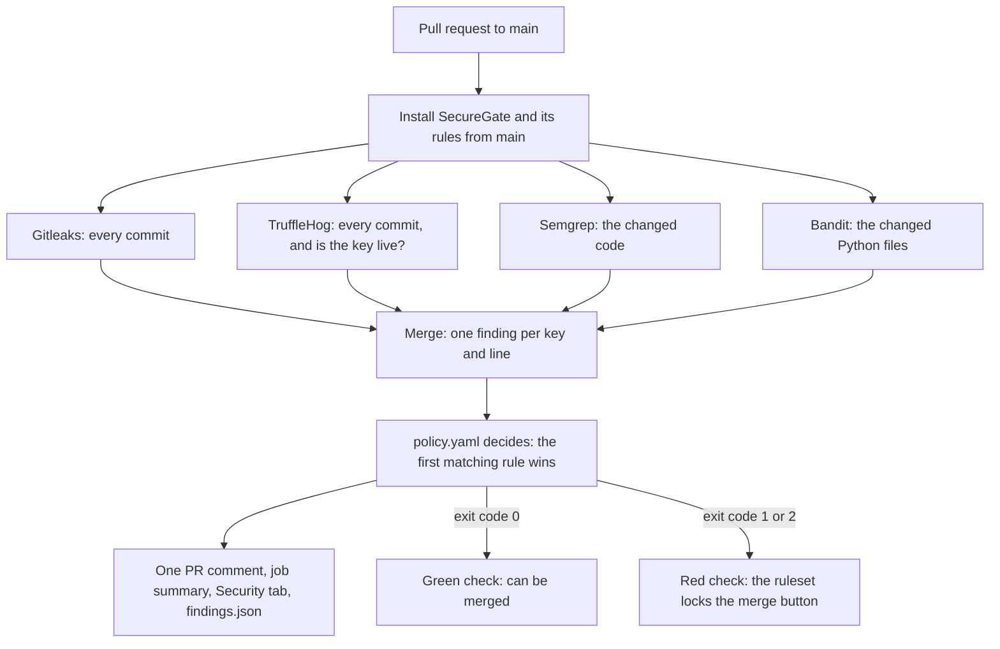

# The two gates

SecureGate can stop a secret in two places: on your laptop, before a commit is saved, and on GitHub, before a pull request is merged. A **pull request** is a request to add a set of commits to the main version of the project; others can review it before it is merged.

## The laptop gate

A **pre-commit hook** is a check that Git runs just before it saves a commit. SecureGate's hook scans only the changes you are about to commit, which takes a second and works offline. Turn it on once, in the SecureGate folder:

```powershell
make hooks
```

When it finds a secret to block, the commit stops and shows what to do:

```
Blocked:
  demo_leak.py:1  acme****RoZ6
    why: provider-keys: A payment, cloud or private key gives direct access to money, data or servers.
    fix: Treat it as leaked. Rotate (replace) the key at the provider now, remove it from the code, and load it from an environment variable or a secrets manager instead.
```

`git commit --no-verify` skips the laptop gate. That is allowed on purpose: sometimes a commit has to go through, for example to show the merge gate at work. The merge gate still catches it.

## The merge gate

On GitHub, every pull request runs a **status check** called `secret-gate`. A status check is a test that GitHub shows next to a pull request, as a green tick or a red cross. This one is a **workflow**, a list of steps that GitHub Actions runs on its own computers: `.github/workflows/secret-gate.yml`. It runs for every pull request to main, whoever opened it, and takes about a minute.



### The four scanners

| Scanner | What it reads | What it adds | If it fails |
|---|---|---|---|
| **Gitleaks** | every commit of the pull request | key shapes, including our rule for ACME Pay tokens | required: the check turns red (exit code 2) |
| **TruffleHog** | every commit of the pull request | asks the provider whether a key still works (a "live check") | required: the check turns red (exit code 2) |
| **Semgrep** | the files the pull request changed, as they are at its end | Semgrep's p/secrets rules, and ours: a secret printed to a log, put in a URL, or given a default in the code | optional: the scan goes on, and the comment says in red that Semgrep did not run |
| **Bandit** | the Python files the pull request changed | passwords written in Python code (checks B105, B106, B107) | optional, like Semgrep |

Gitleaks and TruffleHog read the history because a secret that a later commit deletes is still in it: anyone can open the old commit. Semgrep and Bandit look at code, so they read the code as it is at the end of the pull request.

### One finding per key and line

Several scanners often find the same key. SecureGate first lets the policy decide each scanner's finding on its own, then merges them:

- The same key in the same file and commit is **one finding**, even when the scanners give slightly different line numbers.
- A Semgrep or Bandit finding on the same file and line as a key joins that key's finding.
- The merged finding keeps the **strongest decision** (block, then warn, then ignore) with that rule's reason and fix, the highest severity, the strongest live check, and the names of **every scanner that found it** ("Found by: Gitleaks, TruffleHog").

### The decision order

`policy.yaml` decides each finding: its rules are checked from top to bottom, and the first rule that matches decides. Each rule keeps its number from SecureGate's policy table, and reports name it, such as "rule 8: provider-keys".

| Rule | Name | Decision | Matches |
|---|---|---|---|
| 1 | verified-live | block, critical | TruffleHog asked the provider, and the key works right now |
| 3 | placeholders | ignore | `YOUR_..._HERE`, `changeme`, `EXAMPLE`, `xxxxxxxx`, `dummy` |
| 7 | tests-fixtures-docs | warn | anything in tests, fixtures, docs, an example file or Markdown |
| 8 | provider-keys | block | live payment, cloud and GitHub keys (ACME Pay, Stripe, AWS, Bedrock, GitHub) and private keys |
| 9 | test-mode-keys | warn | ACME Pay and Stripe test-mode keys |
| 10 | hardcoded-passwords | warn | a password or credential written next to its name (Gitleaks, Bandit, Semgrep) |
| 13 | risky-handling | warn | a secret printed or logged, put in a URL, or given a default in the code (our Semgrep rules) |
| 14 | everything-else | warn | anything no rule above covers |

So a live key in `tests/` only warns, unless TruffleHog confirms it is live: rule 1 comes first and always blocks.

### What it writes

| Output | Where | What it shows |
|---|---|---|
| The check | next to the pull request | green (exit code 0), or red (1: a secret is blocked; 2: the scan could not finish) |
| One comment | on the pull request, updated on every push | the verdict (BLOCKED, PASSED WITH WARNINGS or PASSED), a table with the rule, the file and line, the masked value, the scanners and the live check; a checklist to rotate every blocked key; why each warning was not blocked; the ignored findings, folded away |
| The job summary | the check's page: **Details**, then **Summary** | the same report as the comment |
| SARIF | the repository's **Security** tab | the blocks and warnings, as code scanning alerts |
| `findings.json` | a download of the run, called `findings` | everything, masked; `make ci-report` opens it in the dashboard |

Every output holds masked values only. A pull request from a fork gets no comment and no Security tab results, because GitHub gives it a read-only token; its check still runs and decides.

## Why only the merge gate is the real control

- The laptop gate only runs on computers where someone ran `make hooks`, and anyone can skip it with `--no-verify` or switch it off. It is a helpful early warning, not a control.
- The merge gate runs on GitHub, for every pull request, whoever opened it. With the setting below, nothing reaches main unless the check passed.
- It judges each pull request with the SecureGate, `policy.yaml`, `.gitleaks.toml`, `.trufflehog.yaml` and `rules/` of the base branch (usually main), so a pull request cannot loosen the rules that judge it. Changes to those files only count once they are merged. So a change to the gate itself ships in two pull requests: first the code, then the workflow that uses it.
- The job can read the code, write its own comment and upload results to the Security tab, and nothing else: it cannot push or merge.
- One thing it cannot prevent: a pull request that edits the workflow file itself, because GitHub runs the pull request's own copy of that file. `.github/CODEOWNERS` names who must review such changes; see [Limitations](limitations.md) for why that review cannot be required yet.

## The one-time setting, done by hand on GitHub

A **ruleset** is a set of rules GitHub enforces on branches. This one makes the check required:

1. Open the repository on GitHub, then **Settings**.
2. Choose **Rules**, then **Rulesets**, then **New ruleset**, then **New branch ruleset**.
3. Give it a name, such as "Protect main", and set **Enforcement status** to **Active**.
4. Under **Target branches**, choose **Add target** and add **main** (the default branch).
5. Tick **Require a pull request before merging**.
6. Tick **Require status checks to pass**, choose **Add checks** and pick **secret-gate** (from GitHub Actions).
7. Keep the **Bypass list** empty, so that nobody, not even an admin, can skip the check.
8. Select **Create**.

**The check only appears in the list in step 6 after it has run at least once.** If `secret-gate` is not there, open a pull request first (`make demo-clean` opens a harmless one), wait until its check has finished, and try again.

Or set the same ruleset with one command, in the SecureGate folder, as the repository's owner:

```powershell
'{"name":"Protect main","target":"branch","enforcement":"active","bypass_actors":[],"conditions":{"ref_name":{"include":["refs/heads/main"],"exclude":[]}},"rules":[{"type":"deletion"},{"type":"non_fast_forward"},{"type":"pull_request","parameters":{"required_approving_review_count":0,"dismiss_stale_reviews_on_push":false,"require_code_owner_review":false,"require_last_push_approval":false,"required_review_thread_resolution":false}},{"type":"required_status_checks","parameters":{"strict_required_status_checks_policy":false,"do_not_enforce_on_create":false,"required_status_checks":[{"context":"secret-gate","integration_id":15368}]}}]}' | gh api --method POST "repos/{owner}/{repo}/rulesets" --input -
```

It also blocks deleting main and force-pushing to it, as GitHub's own form does by default. `integration_id` 15368 is GitHub Actions, so only the workflow's own check can satisfy the rule.

## Is everything ready?

```powershell
make doctor
```

`securegate doctor` (also choice 9, then 9, in the menu) prints one line per check, PASS, FAIL or SKIP, and changes nothing:

- Gitleaks, TruffleHog, Semgrep and Bandit are installed here, at the versions the workflow uses;
- `policy.yaml` loads, and the workflow has its `secret-gate` job, here and on GitHub's main;
- `gh`, the GitHub command line, is logged in, and `origin` is a GitHub repository;
- main requires the `secret-gate` check (the ruleset above).

It ends with exit code 0 when nothing failed, and 1 when something did.

## Show it

`make demo-leak` (or choice 9, then 2, in the menu) opens a real pull request with a fake ACME Pay key, and `make demo-cleanup` closes every demo pull request again. [Demo: the merge gate](demo-script.md) has all five scenes, what the judges see, and what to say.

## When the check is red

For a real key:

1. **Revoke it at the provider and create a new one.** This is the step that matters: the key is in the pull request's history, and anyone who can see the pull request can read it.
2. Store the new key in a secret manager and take the old one out of the code.
3. The check stays red as long as the key is in any commit of the pull request. The simplest way out is a new branch, made from main, with the change but without the key, and a new pull request for it.

For something that is not a secret, such as a test value: change `policy.yaml` so that it is ignored or only warned about, in a separate pull request. The change counts once that pull request is merged.
