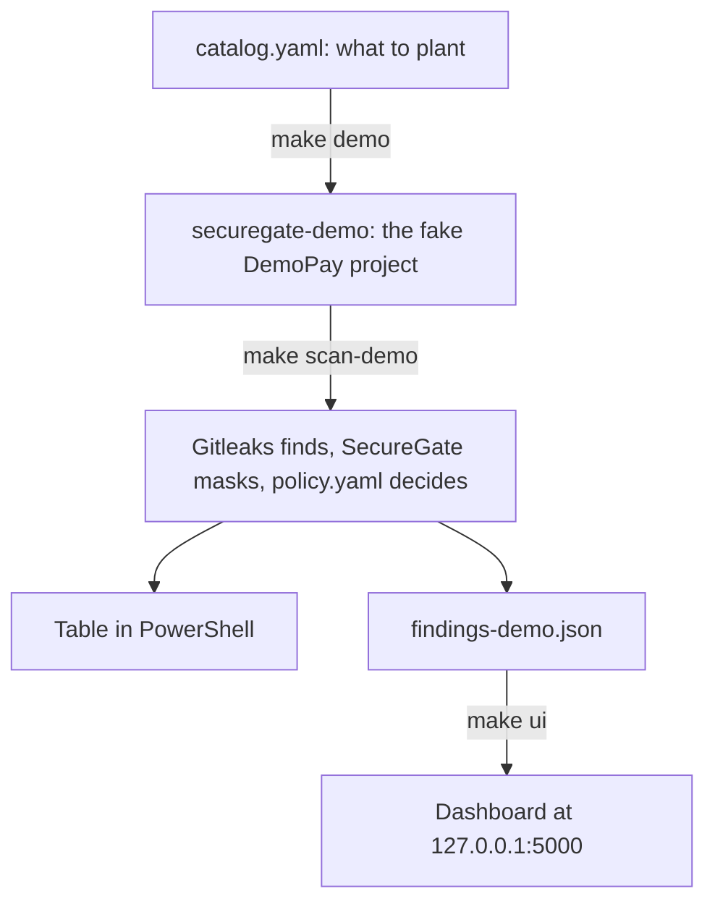

# Presenting SecureGate to judges

This page is your script for showing SecureGate live: what to prepare, what to type, what the judges will see and what to say. The full demo takes about 10 minutes. Everything except the GitHub part works without the internet.

Type each command into **PowerShell**, in the project folder (see "Where do I type the commands?" below). Copy one block at a time. The quoted boxes are what to say: put them in your own words.

## The demo at a glance

| Step | What the judges see | What you type | Time |
|---|---|---|---|
| 1 | The problem SecureGate solves | nothing | 1 min |
| 2 | A fake company's project, with secrets planted in it | `make demo` | 1 min |
| 3 | The scan: masked values, block, warn and ignore | `make scan-demo` | 2 min |
| 4 | The rules, in one readable file | `notepad policy.yaml` | 1 min |
| 5 | The dashboard in the browser | `make ui` | 2 min |
| 6 | A commit stopped on the laptop | four commands | 1 to 2 min |
| 7 | A pull request stopped on GitHub | nothing: a page you prepared | 1 to 2 min |
| 8 | The proof: automatic tests and an honest scorecard | `make test` | 1 min |

Short on time? Run `make demo` before you start, then show steps 1, 3, 5 and 6 (about 6 minutes).

## Where does it start?

**The one-click way:** double-click `Start SecureGate.cmd` in the project folder. It builds the demo project (the first time only), scans it, shows the table and opens the dashboard in your browser: what `make demo`, `make scan-demo` and `make ui` do. Its window must stay open while you use the dashboard; close the window to stop it. If SecureGate is not set up yet, it offers to do that first.

Under the hood, SecureGate is a **command-line program**: you type a command, it does its job, prints the result and stops. Only the dashboard keeps running, and you look at it in your web browser. `Start SecureGate.cmd` just types the commands for you.

- **The program** is `securegate`. `make setup` installed it inside the project folder, as `.venv\Scripts\securegate.exe`. You start it by typing a command, or let `Start SecureGate.cmd` type them.
- **The shortcuts.** Each `make` command is a short name for a longer command. They are all written in the file `Makefile` in the project folder. `make` prints the real command before running it, so the judges can see it.
- **The code.** Every command starts in the same place: the function `main()` in `src/securegate/cli.py`. The line `securegate = "securegate.cli:main"` in `pyproject.toml` connects the command's name to that function. From there, a scan runs Gitleaks (`scanners/gitleaks.py`), masks each value (`pipeline.py` and `mask.py`), lets the policy decide (`policy.py`), then prints and saves the report (`report.py`). [How it's built](how-its-built.md) has the full map.

| You type | Same as typing | What it does |
|---|---|---|
| `make setup` | `py -3.12 -m venv .venv`, then two `pip install` commands | installs SecureGate and its tools into `.venv` (once; needs the internet) |
| `make demo` | `.venv\Scripts\securegate demo-repo --out ..\securegate-demo --seed 42 --force` | builds the demo project |
| `make scan-demo` | `.venv\Scripts\securegate scan ..\securegate-demo --mode repo --out findings-demo.json` | scans the demo project's whole history |
| `make ui` | `.venv\Scripts\securegate ui --report findings-demo.json --open` | starts the dashboard and opens it in the browser |
| `make test` | `.venv\Scripts\python.exe -m pytest` | runs the automatic tests and prints the scorecard |
| `make check` | the code style check (ruff), then the tests | the full check before every commit |
| `make hooks` | `.venv\Scripts\python.exe -m pre_commit install --install-hooks` | turns on the laptop gate (once; needs the internet) |
| `make docs-pdf` | `.venv\Scripts\python.exe tools\docs_pdf.py` | rebuilds the PDFs in `docs\pdf` |

If `make` ever stops working, type the command from the middle column instead: it does exactly the same.

## Where do I type the commands?

In **PowerShell**, opened in the **project folder**: the folder with `Makefile`, `policy.yaml` and `src` in it (on this laptop, `Documents\Nexora`). The easiest way to get there:

1. Open the project folder in File Explorer.
2. Click the address bar at the top, type `powershell` and press Enter.

PowerShell opens, already in the right folder. Another way: open PowerShell from the Start menu and type `cd $HOME\Documents\Nexora`. Or, in VS Code, choose **File > Open Folder**, pick the project folder, then **Terminal > New Terminal**.

To check that you are in the right folder:

```powershell
Test-Path Makefile
```

It prints `True`. If it prints `False`, you are in another folder.

Make the text big enough for the judges: hold Ctrl and turn the mouse wheel.

The dashboard is the only part you see in a web browser, at `http://127.0.0.1:5000`. That address only works on this laptop, and only while `make ui` or the window of `Start SecureGate.cmd` is running.

## Where does the data come from?

Everything the judges see is made on the spot, on this laptop, from files in the project. No real secret, no database and no internet connection is involved.



1. **The plan: `src/securegate/demo/catalog.yaml`.** A list of 20 lines to plant: 9 fake secrets (AWS, Stripe, GitHub and ACME Pay keys, a private key and two passwords) and 11 **decoys**, values that only look like secrets (placeholders, a commit hash, an image written as text, and more).
2. **The demo project: `make demo`.** It builds DemoPay, a small fake payments app, in a folder called `securegate-demo` next to the project folder. DemoPay is a real Git project with 8 commits by an invented developer, Riya Demo. Each fake key is made at that moment: the right beginning, such as `sk_live_` for a Stripe key, plus random characters. The random choices come from seed 42, a fixed number, so every run builds exactly the same project and gives the same results.
3. **The hidden key.** In the third commit, Riya adds a script with a Stripe key in it. In the seventh, she deletes the script. The key is gone from the latest version of the code, but it is still in the history.
4. **The answer sheet: `ground_truth.csv`**, in the `securegate-demo` folder. It lists every planted line and the decision SecureGate should make, never the values. The tests in step 8 build their own copy of the demo and compare SecureGate's results with its answer sheet: that is the scorecard.
5. **The scan: `make scan-demo`.** SecureGate starts **Gitleaks**, a free scanner, which reads all 8 commits and reports every piece of text shaped like a key. Gitleaks hands its results over in a temporary folder, which SecureGate reads and deletes at once. SecureGate masks each value, makes its fingerprint and asks `policy.yaml` for a decision. It prints the table and saves the report as `findings-demo.json` in the project folder. It never prints or saves a whole value.
6. **The dashboard: `make ui`.** It reads `findings-demo.json`, and nothing else, every time a page opens.

Three more things come up in the demo:

- **`securegate demo-token`** makes a new, random fake token for ACME Pay, a payment provider invented for SecureGate's demos. Steps 6 and 7 use it.
- **`sample_findings.json`** is a ready-made report with 22 findings, kept in the project as a spare. If a scan fails on the day, you can still show the dashboard with it.
- **`.securegate\local.key`** is a private random key that the first scan creates. SecureGate only uses it to make fingerprints. It stays on this laptop (Git ignores it). Never share it.

## The day before

Do this with the internet on. Then rehearse the whole demo once, with a timer.

1. Open PowerShell in the project folder and check the tools:

```powershell
.venv\Scripts\securegate version
```

It prints `securegate 0.1.0` and `gitleaks 8.30.1`. If it says `gitleaks not found`, or PowerShell does not recognize `.venv\Scripts\securegate`, follow steps 1 and 3 of [Getting started](getting-started.md).

2. Run every check:

```powershell
make check
```

It takes under a minute and ends with a line like `408 passed, 1 skipped`. The skipped test only runs on macOS and Linux. If any test failed, fix that before the day.

3. Turn on the laptop gate, for step 6:

```powershell
make hooks
```

It prints `pre-commit installed at .git\hooks\pre-commit`.

4. For step 7, prepare the GitHub part (next section). Skip it if you won't show GitHub.
5. Save a backup: screenshots of the dashboard and of the GitHub pull request, in case something fails on the day.
6. If you can, try the projector. On wide screens such as 1920 × 1080, the dashboard uses bigger text by itself.

### Prepare the GitHub part (once)

You need a GitHub account and about 15 minutes.

1. **Put the project on GitHub**, if it is not there yet. On github.com, create a new, empty repository (no README, .gitignore or licence), copy its address, and run:

```powershell
git remote add origin https://github.com/YOUR-NAME/YOUR-REPOSITORY.git
git push -u origin main
```

The first push opens a window to sign in to GitHub. If the push is refused because the repository on GitHub is not empty, create an empty one and use its address instead.

2. **Open the demo pull request**: follow steps 1 to 6 of [Demo: the merge gate](demo-merge-gate.md). Stop after step 6, and keep its step 7 (clean up) for after the judging, so the pull request is still there to show. The check turns red a minute or two after each push.
3. **Make the check required**: follow "The one-time setting" in [The two gates](merge-gate.md). The pull request then says that merging is blocked. From now on, changes only reach `main` through a pull request whose check passed: that is the point.
4. **Before you present**, open the pull request in a browser tab, signed in to GitHub.

## Right before you start (5 minutes)

1. Turn on **Do not disturb** in Windows, and close the apps you don't need.
2. Open PowerShell in the project folder and make the text bigger.
3. Check that Gitleaks is found: `.venv\Scripts\securegate version` prints `gitleaks 8.30.1`.
4. Check that the laptop gate is on: `Test-Path .git\hooks\pre-commit` prints `True`. If it prints `False`, run `make hooks` (needs the internet) or skip step 6.
5. For step 7, open the pull request in a browser tab.
6. Type `cls` to clear the screen.

## The demo, step by step

### Step 1. The problem (1 minute)

Nothing to type.

> Developers sometimes paste passwords and keys into their code by mistake. Once that is committed, deleting the line does not help: Git keeps every old version, and anyone with a copy can read the key. Attackers run bots that search public code for keys all day. SecureGate stops secrets before they get in. Gitleaks, a well-known free scanner, finds anything shaped like a key. One readable file, policy.yaml, decides what to do with it: block, warn or ignore. And SecureGate never shows a whole secret, not even in its own reports.

### Step 2. Build a fake company's project (1 minute)

```powershell
make demo
```

The judges see:

```
".venv/Scripts/python.exe" -m securegate demo-repo --out "../securegate-demo" --seed 42 --force
Demo repo ready: C:\Users\...\Documents\securegate-demo
  8 commits by Riya Demo, seed 42
  planted: 9 secret lines and 11 decoy lines
  ground truth: C:\Users\...\Documents\securegate-demo\ground_truth.csv
Next: scan it with `make scan-demo`
```

> This builds DemoPay, a fake payments app, as a real Git project with 8 commits. We planted 9 fake secrets in it, and 11 decoys: things that only look like secrets. All of them are made up on the spot and work nowhere.

Then show its history:

```powershell
git -C ..\securegate-demo log --oneline
```

```
52f88ba Add tests and docs
0c21e59 Remove one-off maintenance scripts
6ecda21 Add Docker build
3afaea1 Add checkout page
d7e7354 Add Stripe payments client
720d024 Add one-off maintenance scripts
f6b8246 Add configuration
fcfaa5c Start the DemoPay payments service
```

> The newest commit is at the top. In "Add one-off maintenance scripts", Riya pasted a Stripe key into a script. Four commits later, she deleted the script. The key is gone from today's code. Let's see whether it is really gone.

### Step 3. Scan it (2 minutes)

```powershell
make scan-demo
```

The judges see (the "Blocked" part is shortened here):

```
".venv/Scripts/python.exe" -m securegate scan "../securegate-demo" --mode repo --out findings-demo.json
DECISION  RULE                 FILE:LINE                             VALUE
block     github-pat           .env:2                                ghp_****pVJI
block     aws-access-token     config/settings.py:11                 AKIA****NOBM
block     private-key          deploy/server.key:1                   ----****----
block     stripe-access-token  payments/stripe_client.py:5           sk_l****OSJo
block     stripe-access-token  scripts/migrate_customers.py:3        sk_l****562d
block     acme-pay-token       web/checkout.js:2                     acme****DHqJ
warn      generic-api-key      config/app.yaml:8                     d450****df49
warn      generic-api-key      config/settings.py:12                 1C5J****6UuV
warn      stripe-access-token  tests/fixtures/stripe_webhook.json:3  sk_t****Fbyv
warn      generic-api-key      web/version.js:2                      810a****d785
ignore    acme-pay-token       docs/payments.md:10                   acme****xxxx

Blocked:
  .env:2  ghp_****pVJI
    why: github-tokens: A GitHub token gives access to source code and can change it.
    fix: Revoke the token in GitHub settings, create a new one, and keep it out of the code.
  config/settings.py:11  AKIA****NOBM
    why: provider-keys: A payment, cloud or private key gives direct access to money, data or servers.
    fix: Treat it as leaked. Rotate (replace) the key at the provider now, ...
  ... (one entry for each of the 6 blocked findings)

11 findings: 6 block, 4 warn, 1 ignore -> BLOCKED (exit code 1). Details: findings-demo.json
make: *** [Makefile:47: scan-demo] Error 1
```

| Point at | Say |
|---|---|
| any value | "Every value is masked: only the first 4 and last 4 characters are shown. SecureGate never prints, logs or saves a whole secret." |
| `scripts/migrate_customers.py:3` | "This is the Stripe key Riya deleted. It is not in today's code, but SecureGate reads every commit, so it still finds it." |
| the `Blocked:` part | "For every blocked secret, it says why and how to fix it. Both come straight from policy.yaml." |
| `docs/payments.md:10` | "This one is shaped like a real key, but it is all x's: a placeholder in the docs. The policy ignores it, so it bothers nobody." |
| the last two lines | "Exit code 1 means 'something is blocked'. That is the signal that stops a commit or a pull request. make shows it as 'Error 1', which is expected here." |

If you have time, show why reading the history matters. This scans only the files as they are today:

```powershell
.venv\Scripts\securegate scan ..\securegate-demo --mode dir --out findings-dir.json
```

It ends with `10 findings: 5 block, 4 warn, 1 ignore`: the deleted Stripe key is missing.

> A normal scan of today's files misses the deleted key. That is why SecureGate reads the whole history by default.

### Step 4. The rules, in one readable file (1 minute)

```powershell
notepad policy.yaml
```

> This one file decides. The rules are checked from top to bottom, and the first one that matches wins. Placeholders are ignored. Anything in tests, fixtures or docs only gets a warning. Payment, cloud and private keys and GitHub tokens are blocked. Anything else gets a warning. A security team can read and change this without touching the code.

Close Notepad without saving.

If a judge asks you to change a rule, you can do it live:

1. In Notepad, find `name: everything-else` near the end. Change the `decision: warn` below it to `decision: block`, and save with Ctrl+S.
2. Run `make scan-demo` again. The last line now says `11 findings: 9 block, 1 warn, 1 ignore`: the three findings that only this last rule covered are now blocked.
3. Undo the change, and scan again so that the dashboard shows the normal result:

```powershell
git restore policy.yaml
make scan-demo
```

SecureGate never guesses when the file has a mistake, such as `decision: stop`. It says what is wrong, for example `rule #5 ('everything-else'): 'decision' must be one of: block, warn, ignore`, and ends with exit code 2. On an error, it never lets anything through.

### Step 5. The dashboard (2 minutes)

```powershell
make ui
```

PowerShell shows:

```
SecureGate dashboard: http://127.0.0.1:5000/
Showing findings-demo.json. Press Ctrl+C to stop.
```

and the dashboard opens in your browser. PowerShell stays busy while the dashboard runs, and adds a line for each page the browser loads. That is normal.

Show, in this order:

1. **Overview.** "Scan result: BLOCKED (exit code 1)". The cards: 11 findings, 6 blocked, 4 warnings, 1 ignored. The bars count the findings by severity. "About this scan" says what was scanned: the whole Git history, with Gitleaks 8.30.1 and `policy.yaml`.
2. Select the **Blocked** card. The list now shows only the 6 blocked findings.
3. Select the row `scripts/migrate_customers.py:3`, the deleted Stripe key. Its page shows `sk_l****562d` with a BLOCK badge, **How to fix** in four steps (starting with "Revoke it at the provider"), and every field: the commit that added the key, its author Riya Demo, the date, the fingerprint and the confidence score.

> The dashboard is read-only and runs only on this laptop: 127.0.0.1 means "this computer", so nobody else on the network can open it. It needs no internet, and its pages contain no JavaScript. It checks every value again before showing it: a report that holds an unmasked value is refused, never shown.

To stop the dashboard, click in PowerShell and press **Ctrl+C**. Tip: to keep it open for the rest of the demo, run `make ui` in a second PowerShell window instead, or double-click `Start SecureGate.cmd`: it scans again and keeps the dashboard in its own window.

### Step 6. The laptop gate stops a commit (1 to 2 minutes)

Only do this if `Test-Path .git\hooks\pre-commit` printed `True` (see "Right before you start").

> Now I am a developer about to commit a key by mistake. This is a fake token for ACME Pay, a payment provider we invented for demos. It is new and random every time, and it unlocks nothing.

```powershell
$token = .venv\Scripts\securegate demo-token
Set-Content -Path demo_leak.py -Value "ACME_PAY_API_KEY = '$token'" -Encoding utf8
git add demo_leak.py
git commit -m "Demo: add a fake ACME Pay token"
```

The first line makes a token and keeps it without showing it. The second writes it into a one-line file. The last two try to commit that file. The judges see:

```
SecureGate secret scan (staged changes)..................................Failed
- hook id: securegate
- exit code: 1

DECISION  RULE            FILE:LINE       VALUE
block     acme-pay-token  demo_leak.py:1  acme****4HKt

Blocked:
  demo_leak.py:1  acme****4HKt
    why: provider-keys: A payment, cloud or private key gives direct access to money, data or servers.
    fix: Treat it as leaked. Rotate (replace) the key at the provider now, remove it from the code, and load it from an environment variable or a secrets manager instead.

1 finding: 1 block, 0 warn, 0 ignore -> BLOCKED (exit code 1). Details: .securegate\staged-findings.json
```

The masked value is different every time, because the token is new. A warning about CRLF and LF after `git add` is harmless.

> The commit did not happen. Before the key ever leaves the laptop, the developer sees the file and line, the masked key, why it was blocked and how to fix it. It only checks the changes being committed, so it is quick and works offline.

**Always clean up** afterwards:

```powershell
git restore --staged demo_leak.py
Remove-Item demo_leak.py
git status --short
```

`git status --short` no longer lists `demo_leak.py`.

If the commit went through (the laptop gate was not on), first undo it with `git reset --soft HEAD~1`, then run the three clean-up commands. Never push a commit that holds a demo token to `main`.

> A developer can skip this check with git commit --no-verify. That is allowed on purpose: a laptop check is an early warning, not a control. The real control is the second gate, on GitHub.

### Step 7. The merge gate stops a pull request (1 to 2 minutes)

This needs the internet and the GitHub preparation. In the pull request's browser tab, show:

1. The check **secret-gate** with a red cross, and the box at the bottom saying that merging is blocked.
2. Select **Details** next to the check. If you see a list of steps instead of a table, select **Summary** at the top left. The summary says "SecureGate: BLOCKED (exit code 1)", lists `demo_leak.py:1` with the masked token, why it was blocked and the fix, and explains that deleting the line does not turn the check green.
3. The pull request's **Commits** tab: the second commit deleted the token, yet the check is still red.

> This is the real control. It runs on GitHub's computers, for every pull request, whoever opened it. It scans every commit in the pull request, so deleting the key later does not help: it is still in the history, where anyone can read it. It judges each pull request with the rules from the main branch, so a pull request cannot weaken the rules that judge it. And with this setting, nobody, not even an admin, can merge while the check is red.

If the judges want to see how it works, open `.github/workflows/secret-gate.yml`, in VS Code or on GitHub. Every step has a comment in plain English, the tools it downloads are pinned to exact versions, and Gitleaks is checked against its published checksums before it runs.

No internet? Show your screenshots, or `docs/pdf/merge-gate.pdf`, and make the same points.

### Step 8. The proof: tests and an honest scorecard (1 minute)

```powershell
make test
```

After about 35 seconds, the judges see the scorecard, and then the last line: `408 passed, 1 skipped`.

```
repo mode, seed 42
planted lines: 20 (9 secret, 11 decoy)
  hits             15
  misses           2
      db_url_password at config/app.yaml:7: expected warn, got nothing
      generic_password at Dockerfile:6: expected warn, got nothing
  wrong decisions  1
      aws_key_pair at config/settings.py:12: expected block, got warn
  false alarms     2
      uuid at config/app.yaml:8: expected ignore, got warn
      git_sha at web/version.js:2: expected ignore, got warn
```

A second scorecard follows for `dir` mode. It only reads today's files, so it also misses the deleted Stripe key.

> Over 400 automatic tests check SecureGate on every change. Some run the real Gitleaks; others fail if a whole fake secret ever appears in any output, report or dashboard page. The scorecard compares a fresh scan of the demo with its answer sheet, and we show the real numbers: 15 of the 20 planted lines are handled exactly as expected. Two passwords are missed, one inside a database address and one in a Dockerfile, because Gitleaks' built-in rules don't look for them. That is our next improvement.

| Word | Meaning |
|---|---|
| hit | decided as expected; for a decoy, ignored or not reported at all |
| miss | a secret that was not reported: the most dangerous mistake |
| wrong decision | found, but warned about instead of blocked, or the other way round |
| false alarm | a decoy reported as block or warn |

### The close

> To sum up: Gitleaks finds, one readable policy decides, and nobody ever sees a whole secret. Two gates stop leaks: one on the laptop, and the real one on GitHub.

## After the demo

- Stop the dashboard if it is still running: press Ctrl+C in its PowerShell window, or close the window of `Start SecureGate.cmd`.
- Check that `demo_leak.py` is gone: `git status --short` does not list it.
- On GitHub, finish the demo pull request: step 7 of [Demo: the merge gate](demo-merge-gate.md) closes it without merging and deletes the branch.
- You can run `make demo` again at any time. It rebuilds exactly the same demo project.

## Questions judges may ask

**Is any real secret used?** No. Every value in the demo is made up when the demo is built, and ACME Pay does not exist. The project's own files hold no key-shaped text at all: a test scans the project itself to make sure.

**Where are the secrets stored?** Nowhere. A report holds only a masked value and a **fingerprint**: a code that recognizes the same secret again, but cannot be turned back into it. It is made with HMAC-SHA256 and the private key in `.securegate`.

**Why not just use Gitleaks?** Gitleaks finds candidates, and it is good at that. SecureGate adds what a team needs to act on them: one readable policy that decides block, warn or ignore; masking everywhere; a reason and a fix for every finding; one clear exit code for the gates; the dashboard; and the two gates themselves.

**What if a developer skips the laptop check?** `git commit --no-verify` skips it, on purpose. The merge gate on GitHub still scans every commit in the pull request, and the ruleset stops the merge.

**Can a pull request change the rules to let its own secret through?** No. The merge gate takes SecureGate, `policy.yaml` and `.gitleaks.toml` from the main branch, not from the pull request. The one exception is a pull request that changes the workflow file itself, so the ruleset should also require a review. See [The two gates](merge-gate.md).

**What if Gitleaks is missing or crashes, or the policy has a mistake?** SecureGate stops with exit code 2 and says why, and the check turns red. It never says "pass" when it could not do its job: it **fails closed**.

**Doesn't deleting the key fix it?** No. The key stays in the Git history, where anyone with a copy can read it. The real fix is **rotation**: make a new key at the provider and cancel the old one. That is why the fix for every blocked key starts with rotating or revoking it.

**What about false alarms?** Placeholders and documentation examples are ignored. Findings in tests, fixtures and docs only get a warning. Anything the policy is not sure about is a warning, not a block, so the gates only stop work for key types that are clearly dangerous. The scorecard shows the real numbers.

**Can it tell whether a key still works?** No. It never contacts the provider. It treats every blocked key as leaked, which is the safe choice.

**Can it scan any project?** Yes, any Git project: `.venv\Scripts\securegate scan C:\path\to\project --mode repo`. See step 5 of [Getting started](getting-started.md).

**Does it need the internet?** No. Scans, the dashboard and the laptop gate work offline. Only the merge gate needs GitHub.

**What is it built with?** Python 3.12, Gitleaks 8.30.1, Flask for the dashboard, pre-commit for the laptop gate and GitHub Actions for the merge gate, with 409 automatic tests.

## If something goes wrong

| What you see | What to do |
|---|---|
| `make : The term 'make' is not recognized` | Close PowerShell and open it again. If it still happens, type the command from the middle column of the table in "Where does it start?". |
| `make scan-demo` ends with `Error 1` | Nothing: that is expected. It means secrets were found and blocked. |
| `Error 2`, or a line starting with `securegate: error:` | SecureGate could not do its job, and the line says why. Often Gitleaks is not found: run `.venv\Scripts\securegate version`. If it says `gitleaks not found`, close PowerShell and open it again, or install Gitleaks again (step 1 of [Getting started](getting-started.md)). |
| `.venv\Scripts\securegate` is not recognized | You are in the wrong folder (check with `Test-Path Makefile`), or SecureGate is not installed yet: run `make setup` (needs the internet). |
| `cannot start the dashboard on port 5000` | Another program is using that port. Run `.venv\Scripts\securegate ui --report findings-demo.json --port 5050 --open`. |
| The browser did not open | Type `http://127.0.0.1:5000` into the browser's address bar yourself. |
| The dashboard says there is no report | Run `make scan-demo` in a second PowerShell window, then reload the page. |
| PowerShell seems stuck after `make ui` | It is not stuck: it is running the dashboard. Ctrl+C stops it. |
| The commit in step 6 went through | The laptop gate was not on. Undo the commit with `git reset --soft HEAD~1`, then run the clean-up commands of step 6. |
| No internet where you present | Steps 1 to 6 and step 8 work offline. For step 7, show your screenshots. |
| The window of `Start SecureGate.cmd` says `SecureGate stopped` | The lines above it say what went wrong, often one of the problems in this table. Press a key to close the window, fix the problem, then double-click the file again. |
| A scan fails on the day and you can't fix it | Show the spare report: `.venv\Scripts\securegate ui --report sample_findings.json --open`. |

## Where everything is

| Where | What it is |
|---|---|
| `Makefile` | the shortcut commands (`make ...`) |
| `Start SecureGate.cmd` | double-click it to build the demo (the first time only), scan it and open the dashboard |
| `.venv\` | SecureGate and its tools, installed by `make setup`. The program is `.venv\Scripts\securegate.exe`. |
| `src/securegate/` | the program's code. Every command starts in `cli.py`. |
| `policy.yaml` | the rules: block, warn or ignore |
| `.gitleaks.toml` | what Gitleaks looks for, including our rule for ACME Pay tokens |
| `src/securegate/demo/catalog.yaml` | what the demo project plants |
| `..\securegate-demo\` | the demo project that `make demo` builds, next to the project folder |
| `findings-demo.json` | the report of the last `make scan-demo`, with masked values only |
| `sample_findings.json` | a spare report with 22 findings |
| `.securegate\` | the private fingerprint key, and the laptop gate's last report. Never share it. |
| `.pre-commit-config.yaml`, `tools/precommit_hook.py` | the laptop gate |
| `.github/workflows/secret-gate.yml` | the merge gate |
| `tests/` | the automatic tests |
| `docs/` and `docs/pdf/` | these pages, and a PDF copy of each |
